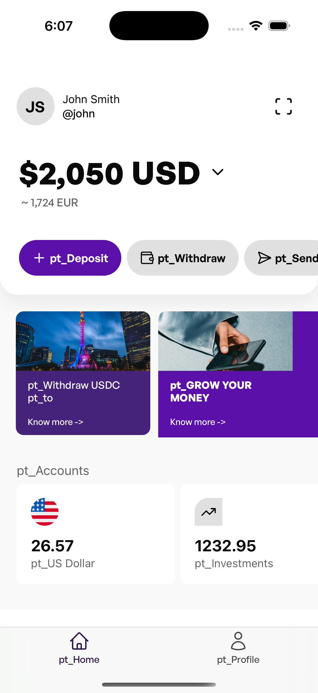

# Project Title

A brief description of your project.

## Video

[View Screen Recording](https://streamable.com/8xoyku)

## Installation

Instructions on how to install the project.

```bash
# Example installation commands
npm install
```

## Usage

Instructions on how to use the project.

```bash
# Example usage commands
npm start
```

## Steps to Reproduce

1. Go to profile/select languages.
2. Select multiple languages.
3. Return to the main screen and see elements malformed.

   Example of malformed elements:
   

## Contributing

Guidelines for contributing to the project.

## License

Specify the license for your project (e.g., MIT). 